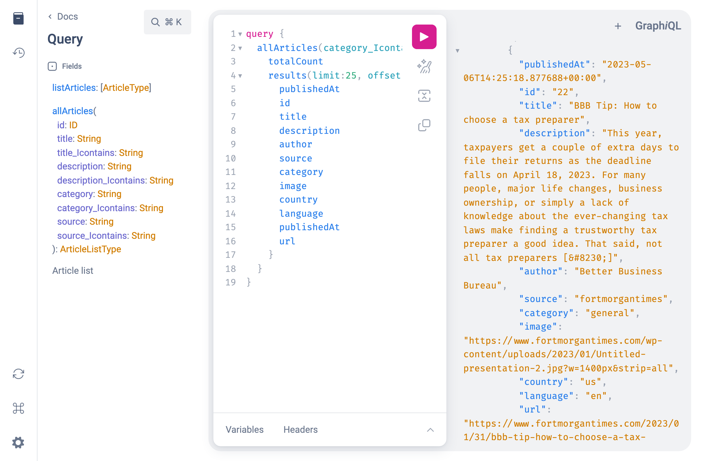
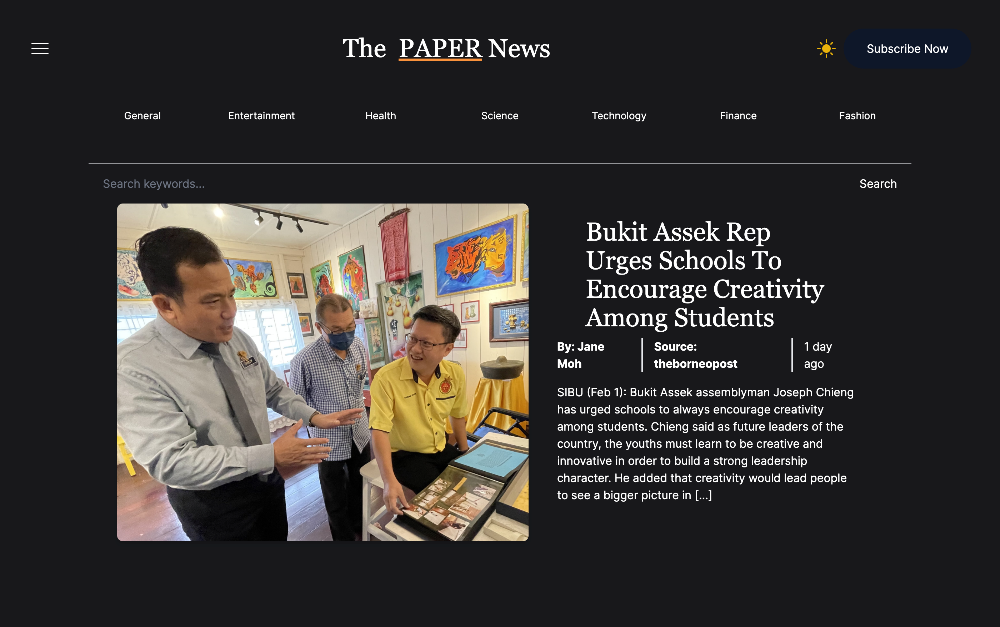
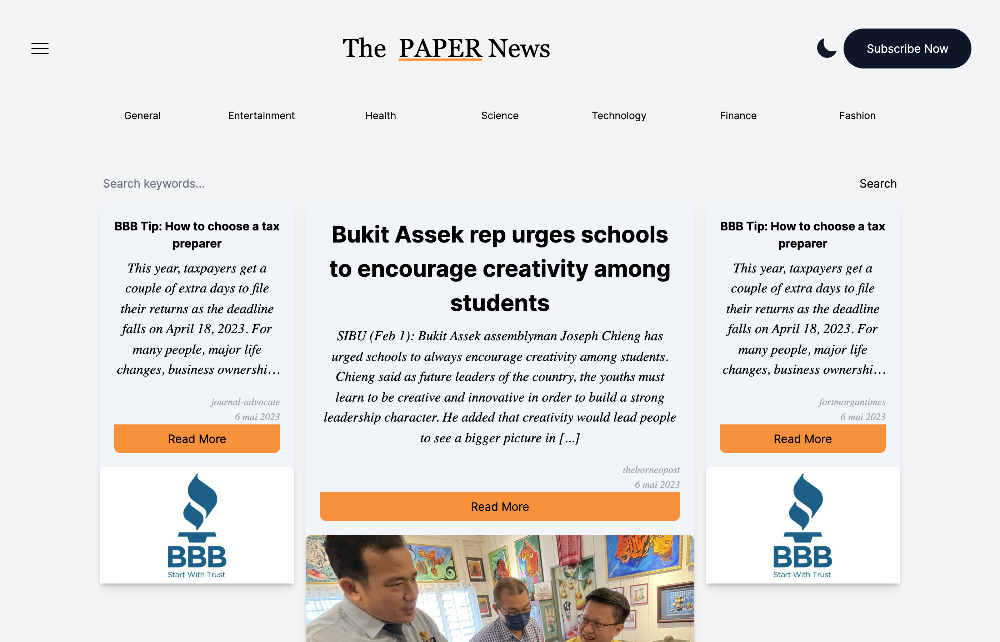
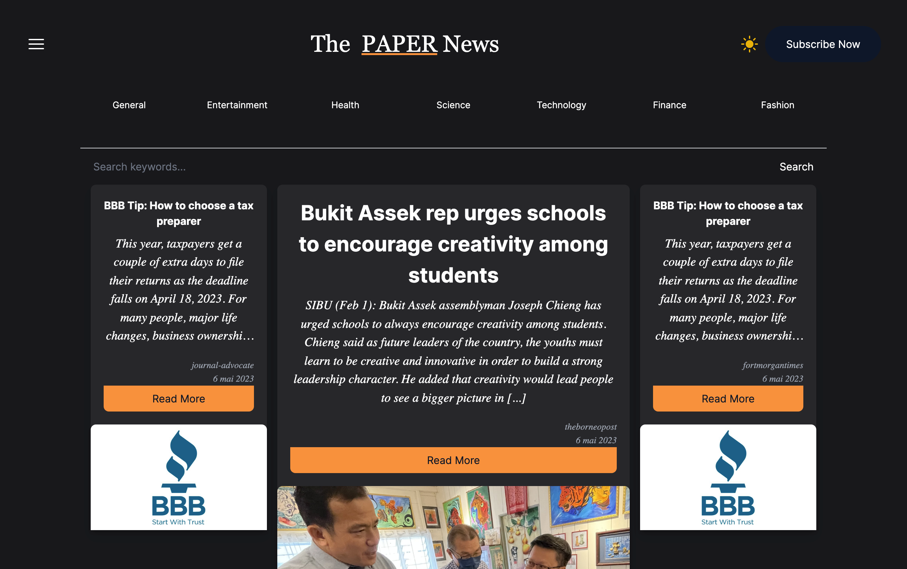

# newspaper

## thanks to
* [Let’s build a LIVE NEWS APP with Next.js 13 (TypeScript, StepZen, Tailwind, Dark Mode, GraphQL)](https://www.youtube.com/live/QcEY72FX9go?feature=share)
* [Modern CSS](https://ishadeed.com/article/rebuild-featured-news-modern-css/)

## Build with
* Next.js
* TypeScript
* Tailwindcss
* Django
* Graphene
* Container queries

# screenshot

